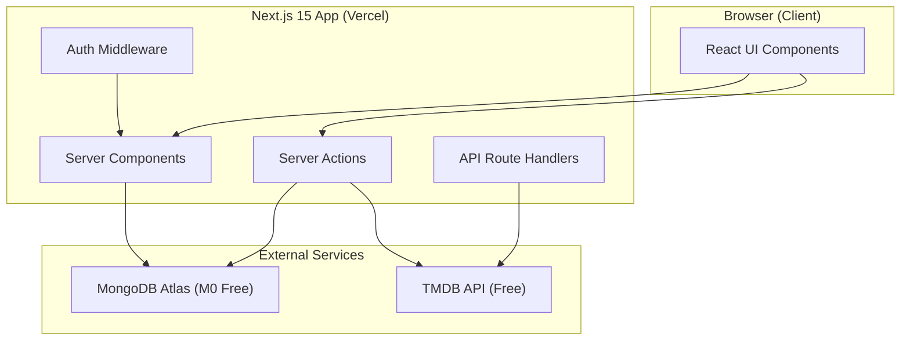

# 🎬 My Movies — Full Project Implementation Plan

A personal movie tracker application to manage watched films, build a future watchlist, and discover must-watch recommendations you may have missed.

---

## Project Summary

| Item | Detail |
|:---|:---|
| **App Name** | My Movies |
| **Framework** | Next.js 15 (App Router, TypeScript) |
| **Database** | MongoDB Atlas — Free M0 Cluster |
| **Auth** | Auth.js (NextAuth v5) — Credentials Provider + JWT |
| **Movie Data** | TMDB API (free for personal/non-commercial use) |
| **Recommendations** | Genre + keyword based content-filtering (no paid AI API) |
| **Styling** | Tailwind CSS 4 |
| **Deployment** | Vercel Hobby (free tier) |
| **Cost** | \$0 — All free tiers |

---

## Architecture Overview

---

## Phase Breakdown

The project is divided into **8 phases**, each with its own detailed `.md` document:

| Phase | Name | Description | Detailed Plan |
|:---:|:---|:---|:---|
| 1 | Project Foundation | Next.js setup, folder structure, tooling, environment | [phase-1-project-foundation.md](file:///Users/lahiruharshana/.gemini/antigravity/brain/0e0240a0-1b21-44f0-9dcd-d71858511b5f/phase-1-project-foundation.md) |
| 2 | Database Layer | MongoDB Atlas setup, Mongoose models, connection singleton | [phase-2-database-layer.md](file:///Users/lahiruharshana/.gemini/antigravity/brain/0e0240a0-1b21-44f0-9dcd-d71858511b5f/phase-2-database-layer.md) |
| 3 | Authentication | Auth.js setup, signup/login, route protection, middleware | [phase-3-authentication.md](file:///Users/lahiruharshana/.gemini/antigravity/brain/0e0240a0-1b21-44f0-9dcd-d71858511b5f/phase-3-authentication.md) |
| 4 | TMDB Integration | Movie search, details fetching, poster images, caching | [phase-4-tmdb-integration.md](file:///Users/lahiruharshana/.gemini/antigravity/brain/0e0240a0-1b21-44f0-9dcd-d71858511b5f/phase-4-tmdb-integration.md) |
| 5 | Core Features | Watched list, Watchlist, ratings, notes, CRUD operations | [phase-5-core-features.md](file:///Users/lahiruharshana/.gemini/antigravity/brain/0e0240a0-1b21-44f0-9dcd-d71858511b5f/phase-5-core-features.md) |
| 6 | Recommendations Engine | Genre-based filtering, trending, must-watch suggestions | [phase-6-recommendations-engine.md](file:///Users/lahiruharshana/.gemini/antigravity/brain/0e0240a0-1b21-44f0-9dcd-d71858511b5f/phase-6-recommendations-engine.md) |
| 7 | UI/UX Polish | Responsive design, animations, dark mode, loading states | [phase-7-ui-ux-polish.md](file:///Users/lahiruharshana/.gemini/antigravity/brain/0e0240a0-1b21-44f0-9dcd-d71858511b5f/phase-7-ui-ux-polish.md) |
| 8 | Testing & Deployment | Unit tests, E2E tests, Vercel deployment, CI/CD | [phase-8-testing-deployment.md](file:///Users/lahiruharshana/.gemini/antigravity/brain/0e0240a0-1b21-44f0-9dcd-d71858511b5f/phase-8-testing-deployment.md) |

---

## Key Design Decisions

### Why TMDB API?
- **Free** for personal/non-commercial projects (just needs attribution)
- Richest movie database: 900k+ movies with posters, genres, cast, keywords
- Excellent search, discover, and similar-movies endpoints
- No payment required — just a free API key

### Why Auth.js (NextAuth v5) with Credentials?
- Fully free, no third-party auth service fees
- Built-in JWT sessions (no session DB overhead)
- First-class Next.js App Router support
- Users register with email + password (hashed with bcryptjs)

### Why Content-Based Recommendations (not AI)?
- Zero cost — no OpenAI/Gemini API calls needed
- Uses TMDB's built-in `/movie/{id}/recommendations` and `/movie/{id}/similar` endpoints
- Supplemented by genre-matching algorithm against user's watched history
- Falls back to TMDB's curated "Top Rated" and "Trending" lists

### Why MongoDB Atlas M0?
- Permanently free 512MB storage
- More than enough for a personal movie tracker (thousands of movies)
- Flexible document schema perfect for movie metadata
- Native Mongoose integration with Next.js

---

## User Review Required

> [!IMPORTANT]
> **TMDB API Key**: You will need to create a free account at [themoviedb.org](https://www.themoviedb.org/) and request an API key. This is free and typically approved instantly. The app must display TMDB attribution (logo) per their terms.

> [!IMPORTANT]
> **MongoDB Atlas**: You'll need to create a free MongoDB Atlas account and provision an M0 cluster. The connection string goes into `.env.local`.

> [!WARNING]
> **No Paid Services**: This plan uses exclusively free tiers. The TMDB API is free for non-commercial use. If you plan to monetize this app in the future, you'd need a commercial TMDB license and Vercel Pro plan.

---

## Open Questions

1. **User Scope**: Is this a single-user personal app, or should it support multiple registered users? *(Plan assumes multi-user with auth)*
2. **Rating System**: Do you want a 5-star rating or a 10-point scale for your watched movies?
3. **Movie Notes**: Do you want the ability to add personal notes/reviews to watched movies?
4. **Social Features**: Any interest in sharing your lists publicly or keeping everything private?
5. **Language**: Should the TMDB data be fetched in English, Sinhala, or both?

---

## Verification Plan

### Automated Tests
- `npm run test` — Jest unit tests for server actions, utility functions, and recommendation logic
- `npm run test:e2e` — Playwright E2E tests for auth flow, search, add-to-list, and recommendations

### Manual Verification
- Search for a movie → verify poster, title, year, genre display
- Add movie to Watched list → verify it persists after page refresh
- Add movie to Watchlist → verify it appears in watchlist tab
- View Recommendations → verify they are relevant to watched genres
- Test auth flow: signup → login → protected routes → logout
- Mobile responsiveness check on iOS Safari and Android Chrome
