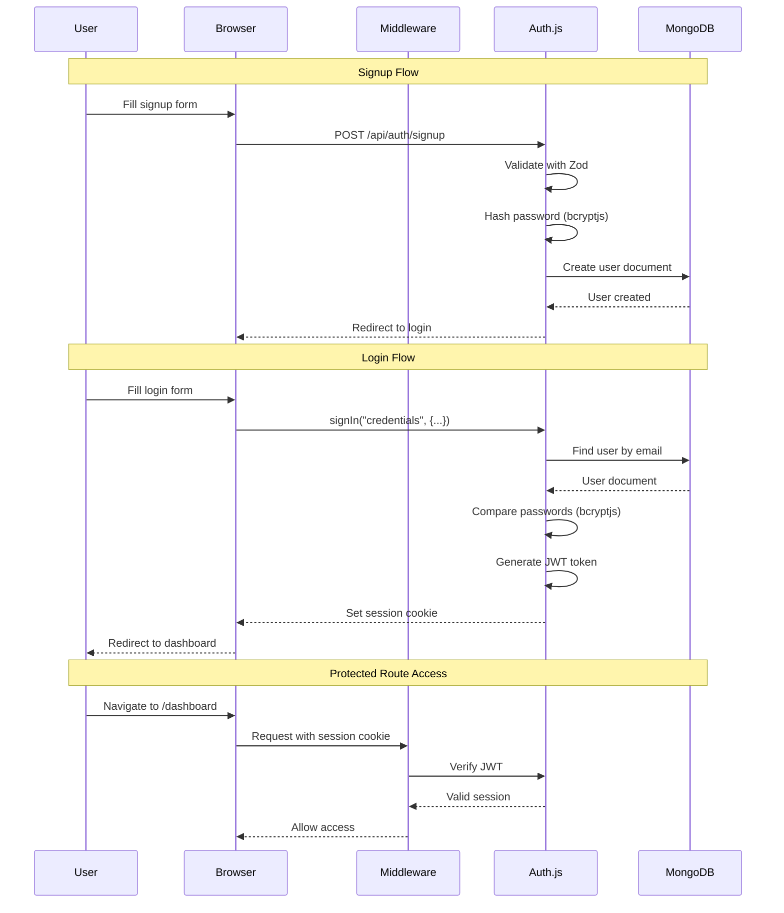

# Phase 3: Authentication

> **Goal**: Implement secure user authentication with Auth.js v5 (NextAuth), credentials provider, JWT sessions, and route protection.

---

## 3.1 Auth.js Configuration

### Architecture Overview



---

## 3.2 File: `src/auth.config.ts`

Edge-compatible auth configuration (used by middleware):

**Purpose:** Separate config file that doesn't import Mongoose (which can't run on Edge runtime)

**Contains:**
- `pages` config — custom login/signup page paths
- `callbacks` — JWT and session callbacks to attach user ID
- `providers` array — empty here (providers go in `auth.ts`)

---

## 3.3 File: `src/auth.ts`

Main Auth.js configuration:

**Credentials Provider setup:**
1. Define credential fields: `email` (type: email), `password` (type: password)
2. `authorize` function:
   - Connect to MongoDB via singleton
   - Find user by email (case-insensitive)
   - If no user found → throw error "Invalid credentials"
   - Compare provided password with stored hash using `bcryptjs.compare()`
   - If mismatch → throw error "Invalid credentials"
   - If match → return user object `{ id, email, name }`

**Session Strategy:** JWT (required for credentials provider)

**Callbacks:**
- `jwt({ token, user })` — Attach `user.id` to token on first sign-in
- `session({ session, token })` — Expose `token.id` as `session.user.id`

**Export:** `{ handlers, signIn, signOut, auth }` from `NextAuth(config)`

---

## 3.4 File: `src/app/api/auth/[...nextauth]/route.ts`

Route handler that exposes Auth.js endpoints:

```
export { GET, POST } from "@/auth"
```

This creates the following API routes automatically:
- `POST /api/auth/signin` — Handle login
- `POST /api/auth/signout` — Handle logout
- `GET /api/auth/session` — Get current session
- `GET /api/auth/csrf` — Get CSRF token

---

## 3.5 File: `src/middleware.ts`

Next.js middleware for route protection:

**Logic:**
```
IF path starts with /(main)/* routes (dashboard, watched, watchlist, etc.)
  → Check for valid session
  → If no session → redirect to /login
  
IF path is /login or /signup
  → Check for valid session  
  → If session exists → redirect to /dashboard (already logged in)
  
ALL other paths → allow through
```

**Matcher config:**
```typescript
export const config = {
  matcher: [
    "/dashboard/:path*",
    "/watched/:path*", 
    "/watchlist/:path*",
    "/recommendations/:path*",
    "/movie/:path*",
    "/search/:path*",
    "/login",
    "/signup",
  ],
};
```

---

## 3.6 Signup Flow

### Server Action: `src/actions/auth.ts`

**`signup(formData)` function:**
1. Extract name, email, password from formData
2. Validate with `signupSchema` (Zod)
3. Check if email already exists in MongoDB
4. Hash password with `bcryptjs.hash(password, 12)` — 12 salt rounds
5. Create new User document in MongoDB
6. Return success or error message
7. Client redirects to login page on success

### Page: `src/app/(auth)/login/page.tsx`

**Login page component:**
- Client Component (needs `"use client"` for form interactivity)
- Fields: Email input, Password input
- Submit button with loading state
- Link to signup page
- Error message display area
- Calls `signIn("credentials", { email, password, redirect: true, redirectTo: "/dashboard" })`

### Page: `src/app/(auth)/signup/page.tsx`

**Signup page component:**
- Client Component
- Fields: Name input, Email input, Password input, Confirm Password input
- Client-side validation: passwords match, min 8 chars
- Calls `signup` server action
- On success → redirect to login with success message
- Error handling for duplicate email

---

## 3.7 Auth Layout

### File: `src/app/(auth)/layout.tsx`

- Centered card layout (no sidebar/navbar)
- App logo/name at top
- Clean, minimal design
- Optional: movie-themed background image or gradient

---

## 3.8 Session Access Patterns

### In Server Components
```typescript
import { auth } from "@/auth";

export default async function Page() {
  const session = await auth();
  // session.user.id, session.user.email, session.user.name
}
```

### In Server Actions
```typescript
import { auth } from "@/auth";

export async function myAction() {
  const session = await auth();
  if (!session) throw new Error("Unauthorized");
  const userId = session.user.id;
}
```

### In Client Components
```typescript
"use client";
import { useSession } from "next-auth/react";

export function MyComponent() {
  const { data: session, status } = useSession();
}
```

---

## 3.9 Session Provider

### File: `src/app/layout.tsx` (Root Layout)

Wrap the app with `SessionProvider` from `next-auth/react` so client components can access session:

```
<SessionProvider>
  {children}
</SessionProvider>
```

---

## 3.10 User Menu Component

### File: `src/components/auth/UserMenu.tsx`

- Display user avatar/initials + name
- Dropdown menu with:
  - Profile link
  - Settings link
  - Separator
  - Sign Out button (calls `signOut()`)

---

## 3.11 Security Considerations

| Concern | Solution |
|:---|:---|
| Password storage | bcryptjs with 12 salt rounds |
| Session management | JWT with `AUTH_SECRET` (32+ bytes) |
| CSRF protection | Built-in to Auth.js |
| Route protection | Middleware + server-side checks |
| Input validation | Zod schemas on all inputs |
| Error messages | Generic "Invalid credentials" (don't reveal if email exists) |

---

## 3.12 Deliverables Checklist

- [ ] `src/auth.config.ts` — Edge-compatible auth config
- [ ] `src/auth.ts` — Full Auth.js config with credentials provider
- [ ] `src/app/api/auth/[...nextauth]/route.ts` — Route handler
- [ ] `src/middleware.ts` — Route protection middleware
- [ ] `src/actions/auth.ts` — Signup server action
- [ ] `src/app/(auth)/layout.tsx` — Auth layout (centered card)
- [ ] `src/app/(auth)/login/page.tsx` — Login page
- [ ] `src/app/(auth)/signup/page.tsx` — Signup page
- [ ] `src/components/auth/LoginForm.tsx` — Login form component
- [ ] `src/components/auth/SignupForm.tsx` — Signup form component
- [ ] `src/components/auth/UserMenu.tsx` — User menu with sign-out
- [ ] SessionProvider added to root layout
- [ ] Test: Signup → Login → Access dashboard → Logout → Redirected to login
- [ ] Git commit: `feat: add authentication with Auth.js credentials provider`

---

## Estimated Time: 3–4 hours
