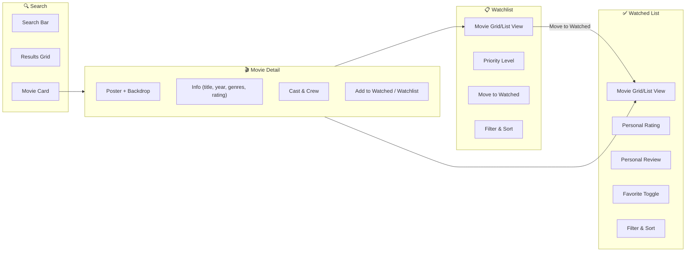

# Phase 5: Core Features

> **Goal**: Build the three main features — Watched Movies list, Watchlist, and Search/Movie Detail — with full CRUD operations.

---

## 5.1 Feature Overview



---

## 5.2 Dashboard Page

### File: `src/app/(main)/dashboard/page.tsx`

**Server Component** — The home page after login.

**Sections:**
1. **Welcome Header** — "Welcome back, {name}" + quick stats
2. **Quick Stats Cards:**
   - Total movies watched (count)
   - Movies in watchlist (count)
   - Average personal rating
   - Most watched genre
3. **Recently Watched** — Horizontal scroll of last 6 watched movies
4. **Watchlist Highlights** — Top 4 high-priority watchlist items
5. **Trending Now** — 6 trending movies from TMDB (discover new films)

---

## 5.3 Search Feature

### Search Bar Component: `src/components/movies/MovieSearchBar.tsx`

**Client Component** with debounced search:
- Input field with search icon
- Debounced input (300ms delay) using `useDebounce` hook
- Shows loading spinner while searching
- Clears results when input is emptied
- Mobile-responsive (full width on mobile, fixed width on desktop)

### Search Hook: `src/hooks/useMovieSearch.ts`

Custom hook that:
1. Takes debounced query string
2. Calls `/api/tmdb/search?query=...`
3. Manages loading, error, and results state
4. Supports pagination (load more results)
5. Returns `{ results, isLoading, error, loadMore, hasMore }`

### Search Results Page: `src/app/(main)/search/page.tsx`

- URL: `/search?q=inception`
- Server Component that reads `searchParams.q`
- Fetches initial results server-side
- Passes to client component for infinite scroll / "Load More"
- Shows "No results found" state
- Each result is a `MovieCard` component

---

## 5.4 Movie Card Component

### File: `src/components/movies/MovieCard.tsx`

Reusable card used across all views:

**Display:**
- Poster image (TMDB, with fallback placeholder)
- Movie title
- Release year
- TMDB rating (star + number)
- Genre badges (first 2–3 genres)
- Overlay on hover showing brief overview

**Actions (contextual):**
- **In search results:** "Add to Watched" / "Add to Watchlist" buttons
- **In watched list:** Personal rating stars, favorite heart, edit button
- **In watchlist:** Priority badge, "Move to Watched" button

**Status Indicators:**
- ✅ Green checkmark if already in watched list
- 📋 Bookmark icon if already in watchlist

**Interaction:**
- Click card → Navigate to `/movie/{tmdbId}` detail page

---

## 5.5 Movie Detail Page

### File: `src/app/(main)/movie/[id]/page.tsx`

**Server Component** with dynamic route `[id]` = TMDB movie ID.

**Layout:**
```
┌──────────────────────────────────────────────┐
│  BACKDROP IMAGE (full width, blurred edges)  │
├──────────┬───────────────────────────────────┤
│          │  Title (Year)                     │
│  POSTER  │  Genres: Action, Sci-Fi, Drama   │
│  IMAGE   │  ⭐ 8.4/10 (TMDB)  •  2h 28min  │
│          │  Director: Christopher Nolan      │
│          │                                   │
│          │  [+ Add to Watched] [+ Watchlist] │
├──────────┴───────────────────────────────────┤
│  Overview / Plot Summary                     │
│  "A thief who steals corporate secrets..."   │
├──────────────────────────────────────────────┤
│  Cast: Leonardo DiCaprio, Tom Hardy, ...     │
│  (Horizontal scroll of cast cards)           │
├──────────────────────────────────────────────┤
│  Similar Movies (horizontal scroll)          │
│  Recommendations (horizontal scroll)         │
└──────────────────────────────────────────────┘
```

**Data Fetching (Server-side):**
1. Fetch movie details from TMDB: `getMovieDetails(id)`
2. Fetch credits: `getMovieCredits(id)`
3. Fetch recommendations: `getMovieRecommendations(id)`
4. Check if movie is in user's watched list (MongoDB)
5. Check if movie is in user's watchlist (MongoDB)

**Action Buttons (Client Component):**
- If **not in any list**: Show "Add to Watched" and "Add to Watchlist"
- If **in watched list**: Show personal rating, review, and "Remove" option
- If **in watchlist**: Show "Move to Watched" and "Remove" option

---

## 5.6 Watched Movies Page

### File: `src/app/(main)/watched/page.tsx`

**Server Component** — User's complete watched history.

**Features:**

### View Modes
- **Grid View** — Movie poster cards in a responsive grid (default)
- **List View** — Compact list with more info per row

### Sorting Options
| Sort | Direction |
|:---|:---|
| Date Added | Newest first (default) |
| Date Added | Oldest first |
| Personal Rating | Highest first |
| TMDB Rating | Highest first |
| Title | A → Z |
| Release Year | Newest first |

### Filters
- **Genre filter** — Multi-select dropdown of genres from user's movies
- **Rating filter** — Minimum personal rating slider (1–10)
- **Year range** — Release year range picker
- **Favorites only** — Toggle to show only favorites

### Movie List Item (List View): `src/components/movies/MovieListItem.tsx`
```
┌────────┬───────────────────────────────────────┬────────┐
│ POSTER │ Title (Year)                          │ ⭐ 8/10│
│ (small)│ Action, Sci-Fi • 2h 28min             │ ❤️ Fav │
│        │ Personal note: "Mind-blowing film..."  │ ✏️ 🗑️ │
└────────┴───────────────────────────────────────┴────────┘
```

### Actions on Each Movie
- **Rate**: Click stars to set/update personal rating (1–10)
- **Review**: Click to add/edit personal notes
- **Favorite**: Toggle heart icon
- **Remove**: Delete from watched list (with confirmation modal)
- **View Details**: Navigate to movie detail page

### Empty State
- Illustration + "You haven't watched any movies yet"
- CTA button: "Search for movies to add"

---

## 5.7 Watchlist Page

### File: `src/app/(main)/watchlist/page.tsx`

**Server Component** — User's planned viewing list.

**Features:**

### View Modes
- Grid View and List View (same as watched)

### Sorting Options
| Sort | Direction |
|:---|:---|
| Date Added | Newest first (default) |
| Priority | High → Low |
| TMDB Rating | Highest first |
| Release Year | Newest first |

### Filters
- **Priority filter** — High / Medium / Low
- **Genre filter** — Multi-select from watchlist genres

### Priority Badges
- 🔴 **High** — Must watch soon
- 🟡 **Medium** — Want to watch (default)
- 🟢 **Low** — Casual interest

### Actions on Each Movie
- **Change Priority**: Dropdown to change priority level
- **Move to Watched**: Move movie to watched list (opens rating modal)
- **Remove**: Delete from watchlist (with confirmation)
- **Add Reason**: Add a note for why you want to watch it
- **View Details**: Navigate to movie detail page

### Empty State
- Illustration + "Your watchlist is empty"
- CTA button: "Discover movies to add"

---

## 5.8 Add to List Flow

### "Add to Watched" Modal

When user clicks "Add to Watched" from search results or movie detail:

```
┌────────────────────────────────────┐
│  Add "Inception" to Watched List   │
│                                    │
│  Your Rating:  ⭐⭐⭐⭐⭐⭐⭐⭐☆☆  8/10  │
│                                    │
│  When did you watch it?            │
│  [Date Picker: Sep 15, 2024    ]   │
│                                    │
│  Personal Notes (optional):        │
│  ┌─────────────────────────────┐   │
│  │ Amazing visuals, the plot   │   │
│  │ twists were incredible...   │   │
│  └─────────────────────────────┘   │
│                                    │
│  [Cancel]          [Add to List ✓] │
└────────────────────────────────────┘
```

**Server Action:** `addToWatched(movieData)`
1. Get current user session
2. Validate input with Zod
3. Check if movie already in watched list → show error if duplicate
4. Fetch movie details from TMDB (genres, poster, etc.)
5. Create WatchedMovie document in MongoDB
6. Revalidate watched list page cache
7. Show success toast notification

### "Add to Watchlist" Modal

Simpler version:

```
┌────────────────────────────────────┐
│  Add "Inception" to Watchlist      │
│                                    │
│  Priority:                         │
│  (•) High  ( ) Medium  ( ) Low    │
│                                    │
│  Why watch? (optional):            │
│  ┌─────────────────────────────┐   │
│  │ Recommended by a friend...  │   │
│  └─────────────────────────────┘   │
│                                    │
│  [Cancel]          [Add to List ✓] │
└────────────────────────────────────┘
```

---

## 5.9 Server Actions Summary

### File: `src/actions/watched.ts`

| Action | Description |
|:---|:---|
| `addToWatched(data)` | Add movie with rating, review, date |
| `removeFromWatched(tmdbId)` | Remove from watched list |
| `updateRating(tmdbId, rating)` | Update personal rating |
| `updateReview(tmdbId, review)` | Update personal notes |
| `toggleFavorite(tmdbId)` | Toggle favorite status |
| `getWatchedMovies(filters, sort, page)` | Get paginated filtered list |
| `getWatchedCount()` | Get total watched count |
| `getWatchedGenreStats()` | Get genre frequency for recommendations |
| `isMovieWatched(tmdbId)` | Check if specific movie is watched |

### File: `src/actions/watchlist.ts`

| Action | Description |
|:---|:---|
| `addToWatchlist(data)` | Add movie with priority |
| `removeFromWatchlist(tmdbId)` | Remove from watchlist |
| `updatePriority(tmdbId, priority)` | Change priority level |
| `moveToWatched(tmdbId, rating?)` | Move from watchlist → watched |
| `getWatchlistMovies(filters, sort, page)` | Get paginated filtered list |
| `getWatchlistCount()` | Get total watchlist count |
| `isMovieInWatchlist(tmdbId)` | Check if movie is in watchlist |

---

## 5.10 Deliverables Checklist

- [ ] `src/app/(main)/dashboard/page.tsx` — Dashboard with stats and quick access
- [ ] `src/app/(main)/search/page.tsx` — Search results page
- [ ] `src/app/(main)/watched/page.tsx` — Watched movies page
- [ ] `src/app/(main)/watchlist/page.tsx` — Watchlist page
- [ ] `src/app/(main)/movie/[id]/page.tsx` — Movie detail page
- [ ] `src/components/movies/MovieSearchBar.tsx` — Debounced search input
- [ ] `src/components/movies/MovieCard.tsx` — Reusable movie card
- [ ] `src/components/movies/MovieGrid.tsx` — Responsive grid layout
- [ ] `src/components/movies/MovieListItem.tsx` — List view item
- [ ] `src/components/movies/MovieDetailView.tsx` — Detail page layout
- [ ] `src/components/movies/AddToListButton.tsx` — Add to watched/watchlist
- [ ] `src/components/movies/MovieFilters.tsx` — Filter & sort controls
- [ ] `src/components/ui/StarRating.tsx` — Interactive star rating
- [ ] `src/components/ui/Modal.tsx` — Reusable modal component
- [ ] `src/hooks/useDebounce.ts` — Debounce hook
- [ ] `src/hooks/useMovieSearch.ts` — Movie search hook
- [ ] `src/actions/watched.ts` — All watched list server actions
- [ ] `src/actions/watchlist.ts` — All watchlist server actions
- [ ] Test: Search movie → Add to watched with rating → Appears in watched list
- [ ] Test: Add to watchlist → Move to watched → Removed from watchlist, added to watched
- [ ] Test: Filters and sorting work correctly
- [ ] Git commit: `feat: add core movie tracking features (watched, watchlist, search)`

---

## Estimated Time: 6–8 hours
