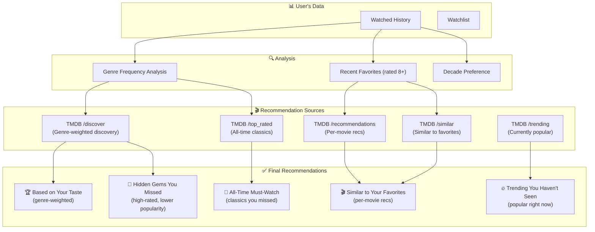

# Phase 6: Recommendations Engine

> **Goal**: Build a smart, free recommendation system that suggests must-watch movies based on the user's watched history — no paid AI APIs required.

---

## 6.1 Recommendation Strategy

We combine **three approaches** to generate diverse, relevant recommendations:



---

## 6.2 Recommendation Algorithm

### Step 1: Analyze User's Watched History

**Server Action:** `analyzeWatchedHistory(userId)`

```
Input: User's watched movies from MongoDB
Output: {
  topGenres: [{id, name, count, percentage}],     // Sorted by frequency
  favoriteMovies: [tmdbIds],                        // Rated 8+ by user
  recentFavorites: [tmdbIds],                       // Last 10 highly-rated
  averageRating: number,                            // User's avg rating
  totalWatched: number,
  preferredDecades: ["2010s", "2000s"],             // Most common release decades
  watchedTmdbIds: Set<number>,                      // For exclusion filter
  watchlistTmdbIds: Set<number>,                    // For exclusion filter
}
```

### Step 2: Generate Recommendations from Multiple Sources

#### Source A: Genre-Weighted Discovery
- Take user's top 3 genres
- Use TMDB `/discover/movie` with `with_genres` parameter
- Weight by genre frequency (more of what they watch most)
- Filter: `vote_average.gte=7.0`, `vote_count.gte=100`
- Sort: `vote_average.desc`

#### Source B: Similar to Favorites
- Take user's top 5 favorite movies (highest personal rating)
- For each, call TMDB `/movie/{id}/recommendations`
- Merge results, removing duplicates

#### Source C: Hidden Gems
- Use TMDB `/discover/movie` with user's top genres
- Filter: `vote_average.gte=7.5`, `vote_count.gte=50`, `vote_count.lte=500`
- This finds highly-rated but less-popular movies (hidden gems)

#### Source D: Trending Unseen
- Fetch TMDB `/trending/movie/week`
- Filter out movies the user has already watched or has in watchlist

#### Source E: All-Time Classics
- Fetch TMDB `/movie/top_rated` (multiple pages)
- Filter out already watched movies
- These are must-watch films the user might have missed

### Step 3: Merge, Deduplicate, and Score

```
For each recommended movie:
  1. Remove if tmdbId is in watchedTmdbIds (already watched)
  2. Remove if tmdbId is in watchlistTmdbIds (already planned)
  3. Calculate relevance score:
     - +3 points if genre matches user's #1 genre
     - +2 points if genre matches user's #2 genre
     - +1 point if genre matches user's #3 genre
     - +1 point per 0.5 TMDB rating above 7.0
     - +2 points if from user's preferred decade
     - +1 point if recommended by multiple sources
  4. Sort by relevance score (descending)
  5. Group into categories for display
```

---

## 6.3 Recommendations Page

### File: `src/app/(main)/recommendations/page.tsx`

**Server Component** that generates and displays recommendations.

### Page Layout

```
┌──────────────────────────────────────────────┐
│  🎬 Recommended For You                      │
│  Based on your {totalWatched} watched movies │
├──────────────────────────────────────────────┤
│                                              │
│  🏆 Based on Your Taste                      │
│  You love Action & Sci-Fi — try these:       │
│  ┌────┐ ┌────┐ ┌────┐ ┌────┐ ┌────┐ >>>    │
│  │    │ │    │ │    │ │    │ │    │          │
│  │ 🎬 │ │ 🎬 │ │ 🎬 │ │ 🎬 │ │ 🎬 │          │
│  └────┘ └────┘ └────┘ └────┘ └────┘          │
│                                              │
│  🎬 Because You Liked "Inception"            │
│  ┌────┐ ┌────┐ ┌────┐ ┌────┐ ┌────┐ >>>    │
│  │    │ │    │ │    │ │    │ │    │          │
│  └────┘ └────┘ └────┘ └────┘ └────┘          │
│                                              │
│  💎 Hidden Gems You Might Love               │
│  Highly rated films you may have missed:     │
│  ┌────┐ ┌────┐ ┌────┐ ┌────┐ ┌────┐ >>>    │
│  │    │ │    │ │    │ │    │ │    │          │
│  └────┘ └────┘ └────┘ └────┘ └────┘          │
│                                              │
│  🔥 Trending Movies You Haven't Seen         │
│  Popular right now:                          │
│  ┌────┐ ┌────┐ ┌────┐ ┌────┐ ┌────┐ >>>    │
│  │    │ │    │ │    │ │    │ │    │          │
│  └────┘ └────┘ └────┘ └────┘ └────┘          │
│                                              │
│  👑 All-Time Must-Watch Classics              │
│  Essential films every movie lover should    │
│  see — and you haven't watched them yet:     │
│  ┌────┐ ┌────┐ ┌────┐ ┌────┐ ┌────┐ >>>    │
│  │    │ │    │ │    │ │    │ │    │          │
│  └────┘ └────┘ └────┘ └────┘ └────┘          │
│                                              │
│  ┌──────────────────────────────────────┐    │
│  │ 📊 Your Movie Profile               │    │
│  │ Top Genres: Action (35%), Sci-Fi    │    │
│  │ (25%), Drama (20%)                  │    │
│  │ Avg Rating: 7.8 / 10               │    │
│  │ Total Watched: 47 movies           │    │
│  └──────────────────────────────────────┘    │
└──────────────────────────────────────────────┘
```

---

## 6.4 Recommendation Categories

### Category 1: "Based on Your Taste"
- **Source:** TMDB `/discover/movie` with user's top genres
- **Count:** 10–20 movies
- **Logic:** Weighted by genre frequency
- **Display:** Horizontal carousel with "See All" link

### Category 2: "Because You Liked [Movie]"
- **Source:** TMDB `/movie/{id}/recommendations` for top 3 favorites
- **Count:** 5 per favorite movie (15 total)
- **Logic:** Direct per-movie recommendations from TMDB
- **Display:** Grouped by source movie, horizontal carousel

### Category 3: "Hidden Gems"
- **Source:** TMDB `/discover/movie` filtered for high rating, low popularity
- **Count:** 10 movies
- **Logic:** `vote_average >= 7.5` AND `vote_count` between 50–500
- **Display:** Horizontal carousel with "Why it's hidden" tooltip

### Category 4: "Trending You Haven't Seen"
- **Source:** TMDB `/trending/movie/week`
- **Count:** 10 movies (after filtering out watched)
- **Logic:** Currently popular, not yet watched
- **Display:** Horizontal carousel with trending badge

### Category 5: "All-Time Must-Watch"
- **Source:** TMDB `/movie/top_rated` (pages 1–5)
- **Count:** 10 movies (after filtering out watched)
- **Logic:** Top 250 movies the user hasn't seen
- **Display:** Horizontal carousel with rank badge

---

## 6.5 Server Action

### File: `src/actions/recommendations.ts`

```
generateRecommendations(userId)
├── analyzeWatchedHistory(userId)
│   ├── Query MongoDB for all watched movies
│   ├── Calculate genre frequencies
│   ├── Identify favorites (rated 8+)
│   └── Build exclusion set (watched + watchlist tmdbIds)
│
├── fetchGenreBasedRecs(topGenres, excludeIds)
│   └── TMDB /discover/movie with genre filters
│
├── fetchPerMovieRecs(favoriteMovieIds, excludeIds)
│   └── TMDB /movie/{id}/recommendations for each
│
├── fetchHiddenGems(topGenres, excludeIds)
│   └── TMDB /discover with popularity filters
│
├── fetchTrendingUnseen(excludeIds)
│   └── TMDB /trending/movie/week
│
├── fetchClassicsUnseen(excludeIds)
│   └── TMDB /movie/top_rated
│
└── Return categorized recommendations
```

---

## 6.6 Edge Cases

| Scenario | Handling |
|:---|:---|
| **User has 0 watched movies** | Show trending + top rated only. Prompt: "Add watched movies to get personalized recommendations!" |
| **User has < 5 watched movies** | Show basic genre-based + trending. Note: "Add more movies for better recommendations" |
| **User has watched everything recommended** | Show "You've seen everything we recommend! Try exploring new genres." + discovery by genre |
| **All top genres are the same** | Diversify by also recommending from user's less-watched genres |
| **TMDB API errors** | Show cached/fallback recommendations, display error toast |

---

## 6.7 "Quick Add" from Recommendations

Each recommendation card should have quick-action buttons:

- **"+ Watched"** — Add directly to watched list (opens rating modal)
- **"+ Watchlist"** — Add directly to watchlist (default medium priority)
- **"Not Interested"** — Dismiss this recommendation (store in MongoDB to exclude future recommendations)

---

## 6.8 Refresh Strategy

- Recommendations are generated **server-side on page load**
- Cache recommendations for **1 hour** using Next.js revalidation
- User can click "Refresh Recommendations" button to force regeneration
- Recommendations auto-refresh when user's watched list changes significantly

---

## 6.9 Deliverables Checklist

- [ ] `src/actions/recommendations.ts` — Full recommendation generation logic
- [ ] `src/app/(main)/recommendations/page.tsx` — Recommendations page
- [ ] Genre analysis utility function
- [ ] Exclusion filtering (don't recommend already-watched movies)
- [ ] 5 recommendation categories implemented:
  - [ ] Based on Your Taste (genre-weighted)
  - [ ] Because You Liked [Movie] (per-movie recs)
  - [ ] Hidden Gems (high-rated, low-popularity)
  - [ ] Trending You Haven't Seen
  - [ ] All-Time Must-Watch Classics
- [ ] Horizontal carousel component for each category
- [ ] "Quick Add" buttons on recommendation cards
- [ ] Empty state for users with no watched movies
- [ ] Movie Profile stats section
- [ ] Error handling for TMDB API failures
- [ ] Test: Add 5+ watched movies with genres → verify recommendations match taste
- [ ] Test: Already-watched movies don't appear in recommendations
- [ ] Git commit: `feat: add smart recommendation engine with genre-based filtering`

---

## Estimated Time: 4–6 hours
