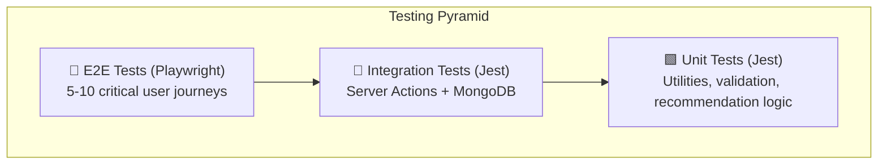

# Phase 8: Testing & Deployment

> **Goal**: Ensure app quality with automated tests, then deploy to Vercel (free tier) with proper CI/CD and production configuration.

---

## 8.1 Testing Strategy



---

## 8.2 Unit Testing (Jest + React Testing Library)

### Setup
```bash
npm install -D jest @testing-library/react @testing-library/jest-dom @types/jest jest-environment-jsdom ts-jest
```

### Configuration: `jest.config.ts`
- Preset: `ts-jest`
- Test environment: `jsdom` (for React components)
- Module alias: Map `@/*` to `src/*`
- Setup file: `jest.setup.ts` (import `@testing-library/jest-dom`)

### Unit Tests to Write

#### Utility Functions
| File | Tests |
|:---|:---|
| `src/lib/utils.test.ts` | `getImageUrl()` returns correct URL for different sizes |
| | `formatDate()` handles various date formats |
| | `truncateText()` truncates with ellipsis |
| `src/lib/validations.test.ts` | `signupSchema` rejects invalid email |
| | `signupSchema` rejects short password (< 8 chars) |
| | `addWatchedMovieSchema` requires tmdbId |
| | `addWatchedMovieSchema` validates rating range (1–10) |

#### Recommendation Logic
| File | Tests |
|:---|:---|
| `src/actions/recommendations.test.ts` | `analyzeWatchedHistory()` calculates correct genre frequencies |
| | `analyzeWatchedHistory()` identifies favorites (rating >= 8) |
| | Exclusion filter removes already-watched movies |
| | Exclusion filter removes watchlist movies |
| | Empty watched history returns empty analysis |
| | Relevance scoring ranks genre matches higher |

#### Components (React Testing Library)
| File | Tests |
|:---|:---|
| `MovieCard.test.tsx` | Renders title, year, and poster |
| | Shows "Add to Watched" button in search context |
| | Shows personal rating in watched context |
| | Handles missing poster gracefully (placeholder) |
| `StarRating.test.tsx` | Renders correct number of filled stars |
| | Calls onChange with correct value on click |
| | Shows read-only mode when disabled |
| `MovieSearchBar.test.tsx` | Debounces input by 300ms |
| | Clears search on empty input |
| `LoginForm.test.tsx` | Validates email format |
| | Shows error for empty fields |
| | Disables submit button during loading |

---

## 8.3 Integration Tests (Jest + MongoDB Memory Server)

### Setup
```bash
npm install -D mongodb-memory-server
```

Uses in-memory MongoDB for fast, isolated database tests.

### Integration Tests to Write

| File | Tests |
|:---|:---|
| `src/actions/watched.test.ts` | `addToWatched()` creates document in MongoDB |
| | `addToWatched()` rejects duplicate (same user + tmdbId) |
| | `removeFromWatched()` deletes correct document |
| | `getWatchedMovies()` returns paginated results |
| | `getWatchedMovies()` filters by genre correctly |
| | `updateRating()` modifies rating field only |
| | `toggleFavorite()` toggles boolean |
| `src/actions/watchlist.test.ts` | `addToWatchlist()` creates document |
| | `moveToWatched()` removes from watchlist + adds to watched |
| | `getWatchlistMovies()` sorts by priority |
| `src/actions/auth.test.ts` | `signup()` hashes password before storing |
| | `signup()` rejects duplicate email |
| | `signup()` validates with Zod schema |

---

## 8.4 E2E Testing (Playwright)

### Setup
```bash
npm install -D @playwright/test
npx playwright install
```

### Configuration: `playwright.config.ts`
- Base URL: `http://localhost:3000`
- Web server: Start `npm run dev` before tests
- Browsers: Chromium (primary), Firefox, WebKit
- Screenshots on failure
- Video on first retry

### E2E Test Scenarios

#### Auth Flow: `tests/e2e/auth.spec.ts`
```
Test 1: Complete signup flow
  → Navigate to /signup
  → Fill name, email, password, confirm password
  → Submit → Redirected to /login
  → Login with same credentials
  → Redirected to /dashboard
  → Dashboard shows user's name

Test 2: Protected route redirect
  → Navigate to /dashboard (not logged in)
  → Redirected to /login

Test 3: Invalid login
  → Navigate to /login
  → Enter wrong credentials
  → Error message displayed
  → Remains on /login
```

#### Search & Add Flow: `tests/e2e/movies.spec.ts`
```
Test 4: Search and add to watched
  → Login
  → Navigate to search
  → Type "Inception"
  → Wait for results
  → Click "Add to Watched" on first result
  → Fill rating (8/10)
  → Submit
  → Navigate to /watched
  → "Inception" appears in watched list

Test 5: Add to watchlist and move to watched
  → Login
  → Search "The Matrix"
  → Click "Add to Watchlist"
  → Navigate to /watchlist
  → "The Matrix" appears
  → Click "Move to Watched"
  → Rate 9/10
  → Navigate to /watched → "The Matrix" is there
  → Navigate to /watchlist → "The Matrix" is gone
```

#### Recommendations Flow: `tests/e2e/recommendations.spec.ts`
```
Test 6: Recommendations page
  → Login (user with 5+ watched movies)
  → Navigate to /recommendations
  → "Based on Your Taste" section visible
  → No already-watched movies appear
  → "Add to Watchlist" button works from rec card
```

---

## 8.5 Test Commands

Add to `package.json` scripts:

```json
{
  "scripts": {
    "test": "jest",
    "test:watch": "jest --watch",
    "test:coverage": "jest --coverage",
    "test:e2e": "playwright test",
    "test:e2e:ui": "playwright test --ui",
    "test:all": "jest && playwright test"
  }
}
```

---

## 8.6 Vercel Deployment

### Step 1: Push to GitHub
```bash
# Create GitHub repository
gh repo create my-movies --private --source=. --push
```

### Step 2: Connect to Vercel
1. Go to [vercel.com](https://vercel.com) → Sign in with GitHub
2. Click "New Project" → Import `my-movies` repository
3. Framework: Next.js (auto-detected)
4. Root directory: `./`
5. Build command: `npm run build` (default)
6. Output directory: `.next` (default)

### Step 3: Environment Variables

Add these in Vercel Dashboard → Settings → Environment Variables:

| Variable | Value | Environment |
|:---|:---|:---|
| `MONGODB_URI` | `mongodb+srv://...` | Production, Preview, Development |
| `AUTH_SECRET` | `(generated 32-byte secret)` | Production, Preview, Development |
| `AUTH_URL` | `https://your-app.vercel.app` | Production |
| `TMDB_API_KEY` | `(your TMDB API key)` | Production, Preview, Development |
| `TMDB_BASE_URL` | `https://api.themoviedb.org/3` | All |
| `TMDB_IMAGE_BASE_URL` | `https://image.tmdb.org/t/p` | All |

### Step 4: MongoDB Atlas Network Access

Add `0.0.0.0/0` to MongoDB Atlas IP whitelist to allow Vercel's serverless functions (which have dynamic IPs) to connect.

### Step 5: Deploy
```bash
git push origin main
# Vercel auto-deploys on push to main branch
```

---

## 8.7 Vercel Free Tier Limits

| Resource | Hobby Limit | Our Expected Usage |
|:---|:---|:---|
| Bandwidth | 100 GB/month | < 5 GB (personal use) ✅ |
| Serverless Function Invocations | 100k/month | < 10k ✅ |
| Build Minutes | 6000 min/month | < 100 min ✅ |
| Deployments | Unlimited | ✅ |
| Team Members | 1 (personal) | ✅ |

---

## 8.8 CI/CD Pipeline (GitHub Actions — Free)

### File: `.github/workflows/ci.yml`

```yaml
name: CI

on:
  push:
    branches: [main]
  pull_request:
    branches: [main]

jobs:
  lint-and-test:
    runs-on: ubuntu-latest
    steps:
      - uses: actions/checkout@v4
      - uses: actions/setup-node@v4
        with:
          node-version: 20
          cache: 'npm'
      - run: npm ci
      - run: npm run lint
      - run: npm run test
      - run: npm run build

  e2e:
    runs-on: ubuntu-latest
    needs: lint-and-test
    steps:
      - uses: actions/checkout@v4
      - uses: actions/setup-node@v4
        with:
          node-version: 20
          cache: 'npm'
      - run: npm ci
      - run: npx playwright install --with-deps
      - run: npm run test:e2e
    env:
      MONGODB_URI: ${{ secrets.MONGODB_URI_TEST }}
      AUTH_SECRET: ${{ secrets.AUTH_SECRET }}
      TMDB_API_KEY: ${{ secrets.TMDB_API_KEY }}
```

> [!NOTE]
> GitHub Actions is free for public repos and provides 2,000 minutes/month for private repos on the free plan.

---

## 8.9 Production Checklist

### Pre-Launch
- [ ] All unit tests pass
- [ ] All integration tests pass
- [ ] All E2E tests pass
- [ ] `npm run build` succeeds without errors
- [ ] No TypeScript errors
- [ ] No ESLint warnings
- [ ] Environment variables set in Vercel
- [ ] MongoDB Atlas IP whitelist configured
- [ ] TMDB attribution visible in footer

### Security
- [ ] `AUTH_SECRET` is a strong 32+ byte random string
- [ ] No API keys exposed in client-side code
- [ ] Passwords hashed with bcryptjs (12 salt rounds)
- [ ] All inputs validated with Zod
- [ ] CSRF protection active (Auth.js built-in)
- [ ] `.env.local` is in `.gitignore`

### Performance
- [ ] Lighthouse performance score > 90
- [ ] Images optimized with Next.js `<Image>`
- [ ] TMDB responses cached appropriately
- [ ] MongoDB connection singleton working
- [ ] No unnecessary client-side JavaScript

### SEO & Meta
- [ ] `metadata` export in root layout (title, description)
- [ ] `robots.txt` and `sitemap.xml` (optional for personal app)
- [ ] Open Graph meta tags for shared links

---

## 8.10 Post-Deployment Monitoring

### Free Monitoring Options
| Tool | Purpose | Cost |
|:---|:---|:---|
| Vercel Analytics | Page views, Web Vitals | Free (basic) |
| Vercel Logs | Function logs, errors | Free (48h retention) |
| MongoDB Atlas Monitoring | DB metrics, slow queries | Free (M0 basic) |
| Sentry (free tier) | Error tracking | Free (5k events/month) |

---

## 8.11 Deliverables Checklist

- [ ] Jest configured with TypeScript and module aliases
- [ ] React Testing Library setup for component tests
- [ ] 15+ unit tests written and passing
- [ ] 8+ integration tests with mongodb-memory-server
- [ ] 6+ E2E tests with Playwright
- [ ] All tests passing: `npm run test:all`
- [ ] Test coverage report generated
- [ ] GitHub repository created
- [ ] Vercel project connected and deployed
- [ ] All environment variables configured in Vercel
- [ ] CI/CD pipeline with GitHub Actions
- [ ] Production build succeeds
- [ ] App accessible at `https://your-app.vercel.app`
- [ ] TMDB attribution visible
- [ ] Production checklist completed
- [ ] Git commit: `feat: add testing suite and deployment configuration`
- [ ] README.md updated with setup instructions

---

## Estimated Time: 4–6 hours

---

## 📊 Total Project Estimate

| Phase | Estimated Time |
|:---:|:---|
| 1 | 1–2 hours |
| 2 | 2–3 hours |
| 3 | 3–4 hours |
| 4 | 2–3 hours |
| 5 | 6–8 hours |
| 6 | 4–6 hours |
| 7 | 4–6 hours |
| 8 | 4–6 hours |
| **Total** | **26–38 hours** |

> This is approximately **4–5 full working days** of focused development.
